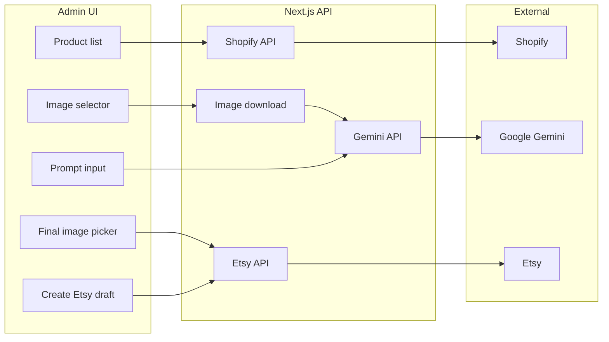

# Shopify → Gemini Images → Etsy Draft Publishing Dashboard

## Goal

Internal tool to **curate and publish** products (not sync inventory):

1. Browse Shopify products and **select images** to use.
2. Send those images + **prompt** to **Gemini** (image generation/editing API).
3. **Choose final image set** (originals + AI-generated).
4. **Create Etsy draft listing** with that set.

---

## Architecture




**Data flow (stateless):** Shopify (products + image URLs, read on demand) → your app (download images, call Gemini) → AI images + description live in **session/UI state** → user picks final set → Etsy API (create draft + upload images). No database.

---

## Tech Stack


| Layer       | Choice                                                                      | Notes                                                                                                           |
| ----------- | --------------------------------------------------------------------------- | --------------------------------------------------------------------------------------------------------------- |
| Frontend    | Next.js 14+ (App Router) + React                                            | Dashboard, product list, image selection, prompt form                                                           |
| API         | Next.js Route Handlers (or API routes)                                      | Server-side only; never expose Shopify/Etsy/Gemini keys to client                                               |
| Persistence | **None** (optional: single JSON file or env for Etsy OAuth tokens only)     | No Postgres; Etsy tokens in file/env so you don't re-auth every time                                            |
| Shopify     | Shopify Admin REST or GraphQL API                                           | Fetch products + image URLs **each time** user opens the app or picks a product                                 |
| Images / AI | Google Gemini API (`gemini-2.5-flash-image` or current image-capable model) | Image + text prompt → generated/edited images; download Shopify images server-side, send as binary/base64       |
| Etsy        | Etsy Open API v3                                                            | OAuth (listings_r, listings_w); create draft listing, then upload images (multipart/form-data, `rank` + `name`) |


You will need:

- **Shopify:** Custom app or dev store with Admin API access (products read).
- **Etsy:** Registered app and OAuth (user signs in once; store refresh token).
- **Google:** API key or Vertex AI for Gemini (image generation/editing).

---

## Why No Database

- **Product list** — Read from Shopify API when the user loads the dashboard or clicks "Refresh". No need to cache.
- **AI images and description** — Generated in the same flow; returned from your API to the frontend. User picks final images (and edits description if needed) in the UI; that selection is sent straight to Etsy when they click "Create Etsy listing". No need to persist AI results.
- **Etsy drafts** — Etsy stores the draft. Your app doesn't need to record it.
- **Only persistence:** Etsy OAuth tokens so the app can call Etsy API without re-login. Use a JSON file on disk or env vars (e.g. paste refresh token after first OAuth).

---

## Core User Flows (Stateless)

### 1. Load products from Shopify

- **UI:** “Sync from Shopify” or “Load products” or auto-fetch on page load.
- **Backend:** Call Shopify Admin API (e.g. `GET /admin/api/2024-01/products.json`), return product list + image URLs to the client. Nothing stored.

### 2. Prepare for Etsy (select images + prompt → generate)

- **UI:** User clicks a product → show product images (from Shopify) → multi-select which images to send to AI → text input for prompt → “Generate images”.
- **Backend:**  
  - Download selected image URLs, call Gemini with image(s) + prompt; get back new image(s) (and optional description). Return image bytes (e.g. base64) and text to the UI. No DB; frontend holds them in state.

### 3. Choose final set and list on Etsy

- **UI:** For that product, Show originals + AI images (and description); user reorders / selects which to use → “Create Etsy draft”.
- **Backend:** Create draft listing on Etsy (title, description, price, category, shipping profile). For each selected image in order: upload via Etsy API (multipart, `name`, `rank`). Done; Etsy holds the draft.

---

## Key Implementation Details

- **Shopify images:** API returns image URLs. Your server must **download** them (or proxy to Gemini) so you can send bytes to Gemini and later to Etsy; do not send raw Shopify URLs to Gemini.
- **Gemini:** Use a model that supports image input + image output (e.g. `gemini-2.5-flash-image`). Send downloaded image bytes + user prompt; parse response for image payload; return to frontend (e.g. base64); no DB persistence.
- **Etsy:**  
  - Create listing first (draft).  
  - Then upload images one-by-one with `rank` (1, 2, 3…) and required `name` field.  
  - Category and shipping profile: map from Shopify product type or use defaults (e.g. in code or a small config file).
- **Auth:** Etsy OAuth: one-time “Connect Etsy” in the dashboard; store tokens in a **file** (e.g. `etsy-tokens.json`) or env; use them in server-side Etsy client.

---

## Suggested Folder Structure

```
app/
  (dashboard)/           # or app/dashboard/
    page.tsx              # Product list (fetch from Shopify on load)
    products/[id]/
      page.tsx            # Image selector + prompt + “Generate”
  api/
    shopify/
      products/route.ts   # GET products from Shopify (read each time)
    gemini/
      generate/route.ts   # Submit selected images + prompt → Gemini; return images + optional description
    etsy/
      oauth/route.ts      # Etsy OAuth callback; write tokens to file
      create-draft/route.ts
lib/
  shopify.ts             # Shopify API client
  gemini.ts              # Gemini image client
  etsy.ts                # Etsy API v3 client (listings + image upload)
  # Optional: etsy-tokens.json for persisted Etsy OAuth tokens (or use env)
components/
  ProductCard.tsx
  ImageSelector.tsx
  PromptForm.tsx
  FinalImagePicker.tsx
```

Use **server actions** or **route handlers** for all Shopify/Gemini/Etsy calls; keep API keys and secrets only on the server.

---

## Etsy / Shopify Mapping (Reference)


| Shopify             | Etsy                                |
| ------------------- | ----------------------------------- |
| title               | title                               |
| body_html           | description (may need sanitization) |
| variants[].price    | price                               |
| product_type / tags | category_id, tags                   |
| images (order)      | upload with rank 1, 2, 3…           |


Etsy-specific: **category_id** (taxonomy), **shipping_profile_id**, **who_made**, **when_made**, **processing_min/max**. Plan for defaults or a small config UI later.

---

## Phased Build (Recommended)

1. **Scaffold** — Next.js app, env (Shopify, Etsy, Gemini keys). No database.
2. **Shopify** — API route to fetch products (and image URLs) on demand; dashboard page listing products.
3. **Image selection + Gemini** — Select images per product, send to Gemini with prompt, return AI images + optional description to UI.
4. **Etsy OAuth** — “Connect Etsy” flow; save tokens to file or env.
5. **Etsy draft** — Final image picker (originals + AI), create draft listing, upload images in order.
6. **Polish** — Error handling, retries, optional “publish” step, basic auth if needed.

---

## What You’re Not Building (By Design)

- No DSers or n8n in this flow.
- No continuous inventory sync; this is **curated publishing** from Shopify → Etsy with an AI image step.
- No AliExpress in this app (per your “just automate Etsy from Shopify” + AI images).

---

## Risks / Notes

- **Gemini rate limits and output format** — Confirm current Gemini image-output API and quotas; handle “no image in response” and retries.
- **Etsy listing rules** — Ensure “who_made” / “when_made” match your products (e.g. “supply” for craft supplies) to avoid policy issues.
- **Image handling** — AI image bytes are returned to the frontend (e.g. base64) and held in React state until the user clicks "Create Etsy listing"; then send those same bytes to Etsy in the same request. No persistent storage needed.

This plan gives you a single, controllable pipeline: **Shopify → your app (Gemini) → Etsy drafts**, with full control over which images and copy go to Etsy.